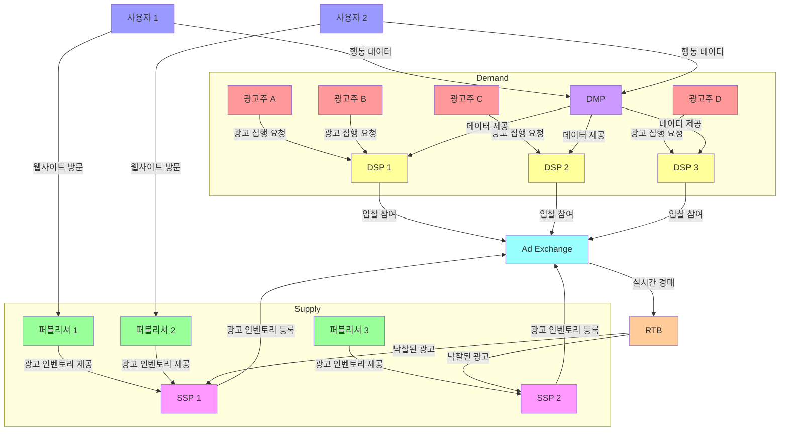

# Programmatic Advertising Example

이 저장소는 Programmatic Advertising 생태계를 쉽게 이해할 수 있도록 TypeScript로 구현한 예제입니다. 코드는 아래 구성요소를 포함합니다.

[Programmatic Advertising 이란?](https://until.blog/@joonseokkim/%ED%94%84%EB%A1%9C%EA%B7%B8%EB%9E%98%EB%A7%A4%ED%8B%B1-%EA%B4%91%EA%B3%A0%EC%9D%98-%EC%9D%B4%ED%95%B4)



각 구성 요소 간의 상호작용을 시뮬레이션하고 Programmatic Advertising 생태계를 이해하는 데 도움이 될 수 있도록 작성해 보았습니다.

- 광고주
- 퍼블리셔
- DSP(수요측 플랫폼)
- SSP(공급측 플랫폼)
- Ad Exchange
- DMP(데이터 관리 플랫폼)

## 주요 기능

- **광고주**: 광고 소재(Creative)를 정의하고 등록합니다.
- **퍼블리셔**: 광고 지면을 등록하고 경매를 위해 인벤토리를 제공합니다.
- **DSP (수요측 플랫폼)**: 입찰 로직을 관리하고, DMP를 통해 사용자 세그먼트를 활용합니다.
- **SSP (공급측 플랫폼)**: 퍼블리셔와 Ad Exchange 간의 통신을 지원합니다.
- **Ad Exchange**: 실시간 입찰(RTB)을 관리하고 낙찰자를 결정합니다.
- **DMP (데이터 관리 플랫폼)**: 사용자 행동 데이터를 수집하고, 더 나은 타겟팅을 위해 정보를 제공합니다.

## 실행 방법

### 사전 요구사항

- Node.js (v16 이상)
- TypeScript

### 설치

1. 저장소 클론
   ```bash
   git clone https://github.com/mansukim1125/programmatic-advertising-example.git
   cd programmatic-advertising-example
   ```

2. 의존성 설치
   ```bash
   npm install
   ```

3. TypeScript 코드 컴파일 및 실행
   ```bash
   npm run start
   ```

### 시뮬레이션

코드는 다음 과정을 시뮬레이션합니다.

1. DMP를 통해 사용자 데이터 수집
2. 광고 지면 및 광고 소재 등록
3. Ad Exchange를 통한 경매 진행
4. 콘솔에 낙찰된 입찰 결과 출력

## 코드 구조

- **Advertiser**: 광고주
- **Publisher**: 매체사
- **DSP**: 입찰 전략 구현 및 DMP와 연동
- **SSP**: 퍼블리셔와 Ad Exchange를 연결하여 광고 수익화 지원
- **Ad Exchange**: 실시간 입찰(RTB) 관리 및 낙찰자 선정
- **DMP**: 사용자 데이터 집계 및 타겟 세그먼트 제공

## 주요 인터페이스 및 클래스

- `Creative`: 광고 소재
- `AdPlacement`: 매체사가 제공하는 광고 지면
- `ImpressionContext`: 입찰 시 유저 및 지면 정보
- `BidRequest` 및 `BidResponse`: 입찰 요청/응답
- `DMP`: DSP에 유저 세그먼트 데이터 제공

## 예제 워크플로우

1. **사용자가 퍼블리셔 웹사이트 방문:**
    - DMP가 사용자 데이터를 수집 (예: 페이지 방문, 클릭)
2. **퍼블리셔가 광고 요청:**
    - SSP가 Ad Exchange에 입찰 요청 전달
3. **DSP가 입찰 제출:**
    - DSP는 DMP로부터 사용자 세그먼트 조회
    - DSP는 적합한 광고 소재를 선택하여 입찰
4. **Ad Exchange가 경매 수행:**
    - 최고 입찰자를 선정 (first/second-price 전략)
5. **광고 노출:**
    - 낙찰된 광고 소재가 최종적으로 사용자에게 제공됨

## 기여

기여를 환영합니다. 위 예시 코드를 개선하기 위한 이슈 또는 PR을 자유롭게 제출해주시면 감사하겠습니다.
